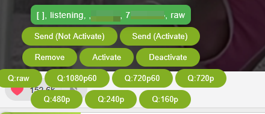

# XhREC

[简体中文](README_zh-CN.md)

Kotlin application for automatic live stream recording, with a browser extension for one-click control.

## Quick Start

```shell
./gradlew build
java -jar build/libs/XhRec-all.jar
```

Then open `https://localhost:8090` for the dashboard.

## CLI Options

| Option           | Description           | Default              |
|------------------|-----------------------|----------------------|
| `-f`, `--file`   | Room list config      | `list.conf`          |
| `-o`, `--output` | Output directory      | `out`                |
| `-t`, `--tmp`    | Temp directory        | `tmp`                |
| `-p`, `--port`   | HTTP server port      | `8090`               |
| `-u`, `--users`  | Users file            | `users.txt`          |
| `-post`          | Post processor config | `postprocessor.json` |

```shell
java -jar build/libs/XhRec-all.jar -p 12340 -f list.conf -post postprocessor.json -t /tmp/xhrec -o /out
```

## Configuration

### list.conf

One room per line. A line starting with `#` is a known room that is **inactive** (not
automatically recorded); the marker may be followed by a space (`# https://...`) or not
(`#https://...`), and the rest of the line is read normally. A line starting with `;` is
ignored entirely, room and all.

```ini
#https://stripchat.com/modelA q:720p limit:120
; https://stripchat.com/modelB q:240p
https://stripchat.com/modelC q:highest
https://stripchat.com/modelD q:highest nopublic nofreespy autopay:private
```

| Field          | Description                                                                                                                                 |
|----------------|---------------------------------------------------------------------------------------------------------------------------------------------|
| `q:<quality>`  | Preferred quality: `240p`, `480p`, `720p`, `720p60`, `1080p`, `1080p60`, or `highest` (default). `raw` is deprecated, use `highest` instead |
| `limit:<sec>`  | Recording time limit in seconds                                                                                                             |
| `size:<bytes>` | Recording size limit (supports suffixes: `K`, `M`, `G`, e.g. `500M`)                                                                        |
| `pkey:<key>`   | Custom psch key                                                                                                                             |
| `nopublic`     | Do not record public (free) shows                                                                                                          |
| `nofreespy`    | Do not record private shows that a free-spy privilege would cover                                                                          |
| `autopay`      | Buy tickets and spy shows automatically (same as `autopay:ticket autopay:private`)                                                         |
| `autopay:ticket`  | Buy a ticket to record group shows                                                                                                       |
| `autopay:private` | Spend tokens to record private shows                                                                                                     |

Recording filters default to: public shows on, free-spy shows on, ticket purchase off,
spy purchase off. `nopublic` and `nofreespy` are therefore opt-out tokens — leaving
them out keeps the defaults — while the `autopay` tokens are opt-in. All four switches
are editable per room in the dashboard (the sliders button on the room row).

If the requested quality is unavailable, the closest match is selected automatically.

### xhrec.json

Platform domains and stream decryption key store. Created with defaults on first run if absent.

```json
{
  "platformHosts": ["stripchat.com"],
  "webSocketHosts": ["websocket-v6.xhamsterlive.com"],
  "hlsHosts": ["media-hls.doppiocdn.org"],
  "hlsMasterHost": "edge-hls.doppiocdn.org",
  "webHost": "xhamsterlive.com",
  "previewHost": "zh.xhamsterlive.com",
  "thumbHost": "img.doppiocdn.org",
  "streamAuthKey": "default psch key, if failed to extract from master playlist",
  "maskSensitiveLogs": true,
  "logLevel": "",
  "decryptKeys": {
    "psch key 1": "decrypt key",
    "psch key 2": "decrypt key"
  }
}
```

| Field              | Description                                                                                                                                            |
|--------------------|--------------------------------------------------------------------------------------------------------------------------------------------------------|
| `platformHosts`    | Ordered list of platform API hosts (host only, no `https://`). On request failure the host enters a cooldown and the next host takes over automatically. Default `["stripchat.com"]` |
| `webSocketHosts`   | Ordered list of WebSocket hosts with the same failover behavior. Default `["websocket-v6.xhamsterlive.com"]`                                            |
| `hlsHosts`         | Ordered list of CDN hosts used for media playlists and segments. Download speed is measured per host (EWMA) and the fastest host is preferred, while ~10% of connections are randomly routed to other hosts to keep measurements fresh. Default `["media-hls.doppiocdn.org"]` |
| `hlsMasterHost`    | Host serving the master playlist; the remaining `hlsHosts` are tried as fallbacks. Default `edge-hls.doppiocdn.org`                                     |
| `webHost`          | Host used by the WebUI for room links. Default `xhamsterlive.com`                                                                                       |
| `previewHost`      | Host used by the WebUI for snapshot previews. Default `zh.xhamsterlive.com`                                                                             |
| `thumbHost`        | Host used by the WebUI for thumbnail images. Default `img.doppiocdn.org`                                                                                |
| `streamAuthKey`    | Default psch key for stream auth                                                                                                                        |
| `maskSensitiveLogs`| Enable log masking (model names, cookies, tokens, proxy URLs). Toggle in WebUI or via `/mask/toggle`. Default `true`                                      |
| `logLevel`         | Root log level (`TRACE`\|`DEBUG`\|`INFO`\|`WARN`\|`ERROR`\|`OFF`). Change it at runtime in the WebUI or via `/log/level`. Empty keeps whatever `logback.xml` configures                              |
| `apiToken`         | When set, every endpoint except `/` requires it as `?token=` or `Authorization: Bearer …`                                                                 |
| `decryptKeys`      | Key-value map of decryption keys (psch key → key)                                                                                                        |

All domains can also be managed at runtime from the WebUI (network icon in the toolbar) or via
`GET /config/hosts` / `POST /config/hosts`; changes are persisted to `xhrec.json` and applied live
(WebSocket reconnects, CDN selection switches immediately).

### users.txt


User cookies for auto-payment. One cookie per line. Lines starting with `#` or `;` are ignored.

Each cookie is validated against the platform API on startup to resolve the user's ID, name, and coin balance. When a
private show requires payment, the system selects a user with sufficient coins.

```
# optional comments
cookie_string_here
```

## WebUI & Browser Extension

### Dashboard

`https://localhost:8090` — manage rooms, view live status, and control recordings.


#### Import favorites

The heart button in the toolbar imports the models one or more accounts favorited on the site:

1. pick the accounts (from `users.txt`) whose favorites should be read;
2. `Fetch Favorites` resolves each favorited model to its room name — models that are already
   rooms are listed as *Already added* and cannot be picked again;
3. uncheck whatever you do not want, then `Import Selected`.

Imported rooms are **not armed** (written commented out in `list.conf`), so nothing starts
recording until you arm them from the room list.

### UserScript

[install](https://greasyfork.org/zh-CN/scripts/582444-xhrec-control-panel)


## API Reference

All endpoints return JSON unless noted. Parameters are passed as query strings.

### Room Management

| Endpoint   | Params                                                          | Description                           |
|------------|-----------------------------------------------------------------|---------------------------------------|
| `/add`     | `name`, `quality`, `active`, `limit`, `autopayTicket`, `autoPaySpy`, `pkey`, `size` | Add a room        |
| `/remove`  | `id`                                                            | Remove a room                         |
| `/restart` | `id`                                                            | Stop then restart recording           |
| `/break`   | `id`                                                            | Temporary stop (resumes on next poll) |

### Room Settings

| Endpoint      | Params                 | Description                    |
|---------------|------------------------|--------------------------------|
| `/activate`   | `id`                   | Enable auto-recording          |
| `/deactivate` | `id`                   | Disable auto-recording         |
| `/quality`    | `id`, `q`              | Set quality                    |
| `/filter`     | `id`, `kind` (`public`\|`freespy`\|`ticket`\|`paidspy`), `v` | Toggle one recording filter |
| `/limit`      | `id`, `v` (seconds)    | Set time limit (0 = unlimited) |
| `/sizelimit`  | `id`, `v`              | Set size limit (0 = unlimited) |

### Status & Monitoring

| Endpoint     | Description                                             |
|--------------|---------------------------------------------------------|
| `/status`    | Active room status (segments, bytes, running downloads) |
| `/list`      | All rooms with status, session state, quality           |
| `/dashboard` | Consolidated payload: rooms, statuses, listv2, metrics, and a per-room `hint` explaining why an armed room is not recording (`public_filter_off`, `ticket_purchase_off`, `private_filter_off`, `no_free_spy`, `preconfig_failed` plus an optional raw `detail`) |
| `/diagnose`  | Internal state of every component: state machines, recent transitions, mailbox backlog |
| `/debug/stream` | Live NDJSON tap on the request bus, the data channel and the event bus             |
| `/log/level` | Read (GET) or change (POST) the root log level at runtime                          |
| `/metrics`   | Prometheus metrics endpoint                             |

| `/mask/toggle` | Toggle log masking on/off |
| `/mask/status` | Get current mask status (true/false) |

### Favorites Import

| Endpoint                 | Params        | Description                                                                     |
|--------------------------|---------------|---------------------------------------------------------------------------------|
| `/users`                 |               | Loaded accounts (`userId`, `username`, `coins` — cookies stay in the process)    |
| `/favorites/candidates`  | `users` (ids) | Favorites of those accounts, resolved to room names, `existing` marks known ones |
| `/favorites/import`      | `ids` (POST)  | Import the picked models as disarmed rooms                                       |

### Live Preview

| Endpoint    | Params | Description                         |
|-------------|--------|-------------------------------------|
| `/mse/live` | `id`   | MP4 stream of in-progress recording |

### Server Control

| Endpoint         | Description                                      |
|------------------|--------------------------------------------------|
| `/graceful-stop` | Finish recordings and shut down                  |
| `/stop-server`   | Finish recordings and post-processing, then exit |

### Status Response Format

```json
{
  "Model Name": {
    "total": 10046,
    "success": 9933,
    "failed": 98,
    "bytesWrite": 1409108341,
    "running": {
      "https://...part3.mp4": {
        "type": "PROXY",
        "startAt": 1756357723403
      }
    }
  }
}
```

### Diagnostics & Debug Stream

Use these when a room looks wrong but the logs are quiet — for example a room that reports
`Recording` while nothing is being downloaded. They are read-only: playlist URLs are reduced to
their path, and secrets (auth key, API token, decrypt keys, stream tokens) are only ever reported
as present/absent, never by value.

> If `apiToken` is set in `xhrec.json`, every endpoint except `/` requires it: append
> `?token=<apiToken>` or send `Authorization: Bearer <apiToken>`.

#### `/diagnose` — internal state of every component

Without parameters it lists the live components, the sections each understands, and whether any
debug tap is currently armed:

```shell
curl -sk https://localhost:8090/diagnose
```

```json
{
  "components": [
    { "name": "SchedulerComponent", "sections": ["summary", "entries", "history"] },
    { "name": "SessionComponent", "sections": ["summary", "entries", "history"] },
    { "name": "DownloaderComponent", "sections": ["summary", "entries"] }
  ],
  "monitor": { "watched": [], "dropped": 0 }
}
```

With `actor=` you get that component's view. Every component answers `summary` (identity, liveness,
`mailboxDepth`); `section=entries` adds per-room or per-file detail; `section=history` returns the
recent state-machine transitions. `room=<id>` narrows it to one room.

```shell
curl -sk "https://localhost:8090/diagnose?actor=SessionComponent&section=entries&room=206236901"
```

```json
{
  "actor": "SessionComponent",
  "started": true,
  "mailboxDepth": 0,
  "sessionCount": 1,
  "states": { "206236901": "Recording" },
  "entries": [
    {
      "roomId": 206236901,
      "roomName": "fox-yiyi",
      "quality": "240p",
      "playlistPath": "https://media-hls.doppiocdn.org/b-hls-22/206236901/206236901_240p_h264.m3u8",
      "noProgressMs": 1932000,
      "segmentIndex": 0,
      "lastSegmentId": 1750,
      "lastPollSegmentCount": 3,
      "lastPollSkipped": 2,
      "lastPollEnqueuedMedia": false,
      "playlistLoopRunning": true,
      "skipStreak": { "skipped": 987, "minId": 1002, "maxId": 1004, "reported": true },
      "fsm": { "state": "Recording", "history": [ "…" ] }
    }
  ]
}
```

**How to read a stuck room.** The three fields below tell the two failure modes apart, which is
otherwise invisible:

| Field | Meaning |
| --- | --- |
| `lastPollSegmentCount` | media segments the last playlist actually advertised |
| `lastPollEnqueuedMedia` | whether any of them was queued for download |
| `lastPollSkipped` | how many were skipped as already covered by the resume mark (normal) |
| `lastPollGap` | how many ids the playlist jumped over this poll and never showed us (lost) |
| `previousNewSegmentId` | the highest id this session has queued; the baseline for the gap check |
| `lastSegmentId` | the resume mark; segments with an id at or below it are skipped |
| `noProgressMs` | how long since the session last queued or received anything |

`lastPollSegmentCount > 0` with `lastPollEnqueuedMedia: false` means the playlist is healthy but
every segment sits behind the resume mark — the stream has not caught up yet. `lastPollSegmentCount
= 0` means the playlist itself is empty. A growing `mailboxDepth` on a component means its actor is
falling behind rather than idle.

`section=history` shows how a room reached its current state, which is usually where the answer is:

```shell
curl -sk "https://localhost:8090/diagnose?actor=SchedulerComponent&section=history&room=206236901"
```

```json
{
  "history": {
    "206236901": [
      { "at": "21:35:08.782", "from": "Preconfiguring", "event": "PreconfigFailed", "target": "KEEP", "data": "SchedulerDriveData(failReason=no free spy access, …)" },
      { "at": "21:35:08.782", "from": "Preconfiguring", "event": "BackToArmed", "target": "-> Armed" },
      { "at": "22:21:15.464", "from": "Armed", "event": "RoomStatusChanged", "target": "KEEP", "data": "SchedulerDriveData(roomStatus=public, …)" },
      { "at": "22:21:15.464", "from": "Armed", "event": "BeginPreconfig", "target": "-> Preconfiguring" },
      { "at": "22:21:49.002", "from": "Preconfiguring", "event": "PreconfigDone", "target": "-> Recording", "data": "SchedulerDriveData(quality=240p, …)" }
    ]
  }
}
```

#### `/debug/stream` — live tap on the internal buses

Streams the request bus, the data channel and the event bus as **one JSON object per line**
(NDJSON). `types` is a comma-separated subset of `request`, `data`, `event` (default
`request,data`):

```shell
curl -skN "https://localhost:8090/debug/stream?types=request,data"
```

```
{"kind":"hello","types":["request","data"],"dropped":0}
{"seq":1,"ts":1789140029897,"kind":"request","id":7,"cmd":"GetRooms","ms":1,"result":"[]"}
{"seq":2,"ts":1789140029898,"kind":"request","id":8,"cmd":"GetRecordingHints","ms":0,"result":"RecordingHintsResponse(count=0)"}
{"seq":3,"ts":1789140029899,"kind":"data","msg":"StreamData","room":206236901,"bytes":131072}
{"kind":"heartbeat","dropped":0}
```

| `kind` | Fields |
| --- | --- |
| `hello` | first line: the accepted `types` and the `dropped` counter |
| `request` | `id`, `cmd`, `ms` (latency), `result` (or the error / `TIMEOUT after Nms`) |
| `data` | `msg` (`StreamStart`/`StreamData`/`StreamEnd`/`StreamEvent`), `room`, `bytes` |
| `event` | `event` (type name), `detail` (shortened `toString`) |
| `heartbeat` | written when idle; also how the server notices a dropped client |

The taps are **opt-in and cost nothing while nobody is watching**: every producer checks whether a
client wants that category before it builds a line. A slow client loses the oldest lines (they are
counted in `dropped`) rather than stalling a download. Closing the connection releases the taps —
`/diagnose` shows them under `monitor.watched`.

Piping through `jq` is the usual way to use it:

```shell
# only slow round trips
curl -skN "https://localhost:8090/debug/stream?types=request" | jq -c 'select(.kind=="request" and .ms > 100)'

# follow one room's data flow
curl -skN "https://localhost:8090/debug/stream?types=data" | jq -c 'select(.room==206236901)'
```

#### `/log/level` — change the log level at runtime

```shell
curl -sk https://localhost:8090/log/level
# {"level":"INFO","levels":["TRACE","DEBUG","INFO","WARN","ERROR","OFF"]}

curl -sk -X POST -d "level=TRACE" https://localhost:8090/log/level
# TRACE

curl -sk -X POST -d "level=LOUD" https://localhost:8090/log/level
# HTTP 400: Unknown log level: LOUD
```

The level is applied to the root logger immediately and persisted to `xhrec.json` (`logLevel`), so
it survives a restart. The noisy third-party loggers pinned in `logback.xml` (netty, ktor, jetty)
keep their own level. The same control is in the WebUI toolbar (the bug icon).

## Post Processing

Defined in `postprocessor.json`. Processors run in sequence after a recording finishes.

### Built-in Processors

| Type        | Description                  |
|-------------|------------------------------|
| `fix_stamp` | Fix MP4 timestamps           |
| `move`      | Move/rename output files     |
| `slice`     | Split video into segments    |
| `shell`     | Run arbitrary shell commands |

### Template Variables

Available in `move` destinations and `shell` arguments:

| Variable                  | Description                            |
|---------------------------|----------------------------------------|
| `{{ROOM_NAME}}`           | Model/room name                        |
| `{{ROOM_ID}}`             | Room ID                                |
| `{{RECORD_START}}`        | Formatted start time                   |
| `{{RECORD_END}}`          | Formatted end time                     |
| `{{RECORD_DURATION}}`     | Duration in seconds                    |
| `{{RECORD_DURATION_STR}}` | Duration as `00h01m30s`                |
| `{{RECORD_QUALITY}}`      | Quality string                         |
| `{{INPUT_ABS}}`           | Input file path                        |
| `{{INPUT_DIR}}`           | Input directory                        |
| `{{INPUT_NAME}}`          | Input filename                         |
| `{{INPUT_NAME_NOEXT}}`    | Filename without extension             |
| `{{TOTAL_FRAMES}}`        | Accurate frame count                   |
| `{{TOTAL_FRAMES_GUESS}}`  | Estimated frame count (FPS × duration) |

### Example Configuration

```json
{
  "default": [
    {
      "type": "fix_stamp",
      "output": "out"
    },
    {
      "type": "move",
      "output": "out/[{{ROOM_ID}}]{{ROOM_NAME}}@{{RECORD_START}}-{{RECORD_END}} {{RECORD_DURATION_STR}}",
      "date_pattern": "yyyy-MM-dd HH:mm:ss"
    },
    {
      "type": "slice",
      "output": "out",
      "duration": "1m10s"
    },
    {
      "type": "shell",
      "noreturn": true,
      "remove_input": false,
      "date_pattern": "yyyy-MM-dd_HH-mm-ss",
      "cmd": [
        "ffmpeg",
        "-hide_banner",
        "-loglevel",
        "error",
        "-stats",
        "-i",
        "{{INPUT_ABS}}",
        "-vf",
        "thumbnail={{TOTAL_FRAMES_GUESS}}/400,scale=200:-1,tile=20x20",
        "-vframes",
        "1",
        "{{INPUT_DIR}}/{{INPUT_NAME_NOEXT}}.thumb.png",
        "-y"
      ]
    }
  ]
}
```

## Logging & Monitoring

Logs are written to `./logs` with daily rotation (`xhrec.yyyy-MM-dd.log`).

### Log Masking

Sensitive information is replaced in log output by default. Static patterns (JWT tokens, cookies, auth URL parameters,
proxy addresses) are masked with `***`. Dynamic strings (model names, usernames) are registered at startup and replaced
with a stable CRC32-based hash that persists within a session but changes on restart, allowing log correlation without
revealing identities. Room ids are masked with the **same hash as the room's model name**, so a `roomId=` and the name it
belongs to read as one entity. Ids are replaced in `roomId=...` keys and in the numeric path segments / file-name prefixes
of http(s) URLs (`/hls/1001/master/1001_auto.m3u8`); a bare number elsewhere in the text is left untouched.

Masking can be toggled at runtime via the eye icon in the WebUI toolbar, or through the API:

```shell
curl -k https://localhost:8090/mask/toggle     # on/off
curl -k https://localhost:8090/mask/status     # current state
```

The setting persists to `xhrec.json` (`maskSensitiveLogs` field).

### Log Level

The root log level can be changed without a restart — from the WebUI toolbar (the bug icon) or via
`POST /log/level`, see [Diagnostics & Debug Stream](#diagnostics--debug-stream). It is persisted in
`xhrec.json` (`logLevel`); leave that field empty to keep whatever `logback.xml` configures.
`TRACE`/`DEBUG` are worth turning on while chasing a specific room; `INFO` keeps the file small the
rest of the time. The noisy libraries pinned in `logback.xml` (netty, ktor, jetty) keep their own
level regardless.

### Diagnosing a stalled recording

**Skipping is the normal steady state, not a fault.** The media playlist is a sliding window that
re-lists segments already written, so every healthy poll skips the overlap and enqueues only what is
new. Those skips are counted in `xhrec_segments_skipped_total{roomId=…}`, which therefore rises
steadily for *any* room that is recording. The signal to watch is that counter climbing while
`xhrec_downloaded_total` stands still.

The opposite failure is `xhrec_segment_missing_total{roomId=…}`: ids the stream published that the
playlist never showed us. If one refresh ends at id 3 and the next already starts at 7, then 4, 5
and 6 are gone — the playlist jumped over them. Nothing else in the pipeline can notice that (a
segment we never hear about never fails and never reaches the downloader), so the session counts it
itself and logs each jump at `DEBUG`:

```
DEBUG v3.SessionEntry - roomId=206236901 playlist went from segment id 1023 to 1028; 4 id(s) in between were never advertised
```

A gap at a session seam is deliberately not counted: after a limit cut, a `Break` or a re-arm the
session has no earlier observation to compare against, so restarting the comparison would otherwise
flag every ordinary cut as lost data.

Per-poll detail is at `TRACE` — opt-in from the WebUI toolbar or `POST /log/level` — so it does not
clutter the log at the default (`INFO`) level. Read it as "N of the M ids this playlist advertised were already
covered, and the mark then moved from A to B":

```
TRACE v3.SessionEntry - roomId=152807806 skipped 1 of 3 advertised segment(s): id 1063 already at or below the resume mark (mark 1063 -> 1065)
```

`id` is the skipped set's own range — a single id when one entry was skipped, not the playlist's
window — and the mark is printed as a transition because by then it has already advanced to this
poll's newest id. So the line above means the window was `1063..1065`, the mark stood at `1063`, so
1063 was already written and skipped while 1064 and 1065 were queued and moved the mark to 1065.

When nothing new has arrived for `thresholdSkipLogDelay`, the session says so **once**, and says what
actually happened rather than a count of skip events (the same ids repeat on every poll, so a running
total would overstate it badly):

```
WARN  v3.SessionEntry - roomId=170139817 no new segments for 32s: the playlist still advertises only id 1025..1027, all already covered by the resume mark (1027)
INFO  v3.SessionEntry - roomId=206236901 caught up with the resume mark after 2154s; 1102 skip event(s) (id 1002..1789), recording resumed
```

Short overlaps after an ordinary cut stay silent; only a *persistent* streak is reported. Two further
lines are worth recognising:

```
WARN  v3.SessionEntry - Recording stalled roomId=…: no segment for 90s (playlist carries 0 media segment(s));
      ending the session so the room re-resolves its stream
WARN  v3.SchedulerEntry - Preconfig failed room=…: playlist unusable (HTTP 404)
```

The first is the stall watchdog ending a session that made no progress for `sessionStallTimeout`,
after which the room re-runs preconfiguration. The second is a preconfig probe that could not use
the variant playlist — an HTTP status, a probe timeout, or a request failure. A 403 or 404
additionally makes the scheduler ask the RoomComponent to re-read the room: the platform already
handed out a token, so the CDN refusing the playlist means the show moved on, and the refreshed
status re-arms a room that stopped being recordable instead of retrying a stream that is gone. A
session that fails just before preconfig asks for the same room, so a hint does not become a second
platform request: the first failure reads the room immediately, and the hints that follow inside
`roomStatusRefreshWindow` collapse into a single catch-up read at the end of that window — debounced,
but never dropped, so a status that moved just after the first read is still noticed. Activation is
a command rather than a hint, so it always reads, and it arms the same window for the hints after it.

When the log alone is not enough, `/diagnose` exposes the same state interactively; see
[Diagnostics & Debug Stream](#diagnostics--debug-stream).

Prometheus metrics are exposed at `/metrics`. Example Grafana dashboard:


